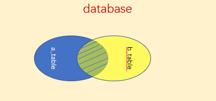
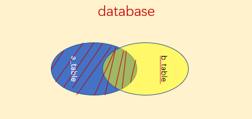
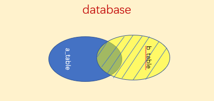

<center><h2><b><font color=green>SQL必知必会第4版:book:</font></b></h2></center>

&nbsp; &nbsp;[![SQL][sql-img]][sql] [![Oracle][oracle-img]][oracle]  [![Chat][chat-img]][chat] [](http://wpa.qq.com/msgrd?v=3&amp;uin=user_id&amp;site=qq&amp;menu=yes)

[sql]:https://www.mysql.com
[sql-img]:https://img.shields.io/badge/MySQL-Web-orange.svg

[oracle]:https://www.oracle.com/index.html
[oracle-img]:https://img.shields.io/badge/ORACLE-Net-red.svg

[chat]: mailto:xxx@qq.com
[chat-img]: https://img.shields.io/badge/Cnet-Email-blue.svg


<div align=center></div>


<!--
整段不可见内容
<div align=center>
-->


<p align=center></p>


<font size=3 color=#ffff41>

* SHOW  显示/查看数据库
    ```SQL
    SHOW DATABASES;
    ```

* CREATE 创建数据库
    ```SQL
    CREATE DATABASE dbname;
    ```
* DROP 删除数据库
    ```SQL
    DROP DATABASE dbname;
    ```
* USE 使用数据库
    ```SQL
    USE dbname;
    ```

* SELECT 选择

    ```SQL
    /*默认升序ASC*/
    SELECT column_name FROM table_name;
    SELECT DISTINCT column_name FROM table_name;/*返回不同值*/
    SELECT column_name FROM table_name LIMIT 5;
    SELECT column_name FROM table_name LIMIT 5 OFFSET 3;
    SELECT column_name FROM table_name LIMIT 5,3;

    /*SELECT语句为测试、检验函数和计算提供了很好的方法。虽然SELECT通常用于从表中检索数据，但是省略了FROM子句后就是简单地访问和处理表达式，例如SELECT 3*2;将返回6，SELECT TRIM(' abc ');将返回abc，SELECT Now();使用Now()函数返回当前日期和时间*/
    ```

* ORDER BY 排序
    ```SQL
    SELECT column1_name column2_name column3_name
    FROM table_name
    ORDER BY column2_name

    ```
  
* DESC 选择降序
  ```SQL
    SELECT column_name FROM table_name DESC;
    /*DESC仅应用到直接位于其前面的列名*/
    SELECT column1_name column2_name
    FROM table_name
    ORDER BY column1_name column2_name DESC;
    /*仅仅对column2_name列降序，其他列默认升序*/
    ```

* WHERE 过滤选择
    * BETWEEN *** AND ***
    * IS NULL
    ```SQL
    /*通过过滤选择不包含指定值的所有行时，你可能希望返回含NULL值的行。但是这做不到。因为未知（unknown）有特殊的含义，数据库不知道它们是否匹配，所以在进行匹配过滤或非匹配过滤时，不会返回这些结果。*/
    SELECT column1_name FROM table_name WHERE column2_name<>2 ORDER BY column1_name;
    ```

* AND OR 且 或
    
    ```SQL
    AND 运算优先级比 OR 高
    SELECT column1_name FROM tablename WHERE column1_name>1 AND column2_name <10 OR column3_name="liu"
    ```

* IN 包含
    ```SQL
    /*WHERE子句中用来指定要匹配值的清单的关键字，功能与OR相当*/
    SELECT column1_name FROM tablename WHERE column2_name IN("key1","key2",...,"keyn") ORDER BY column3_name;
    /*括号里面全部都有，也就类似于OR*/
    ```
* NOT 否定
    ```SQL
    SELECT column1_name FROM tablename WHERE NOT column2_name="key";
    ```

* 通配符 LIKE 操作符
    * % 百分号
    
        ```SQL
        /*检索LIU开头的任意字符*/
        SELECT column1_name FROM tablename WHERE column2_name LIKE "LIU%"
        
        /*检索含有LIU的任意字符*/
        SELECT column1_name FROM tablename WHERE column2_name LIKE "%LIU%"

        /*根据邮件地址的一部分来查找电子邮件,把通配符放在搜索模式中间是很有用的，例如:*/
        WHERE email LIKEb%@liu.com。

        /*包括Access在内的许多DBMS都用空格来填补字段的内容。例如，如果某列有50个字符，而存储的文本为Fish bean bag toy(17个字符),则为填满该列需要在文本后附加33个空格。这样做一般对数据及其使用没有影响，但是可能对上述SQL语句有负面影响。子句 WHERE prod_name LIKE 'F%y'只匹配以F开头、以y结尾的prod_name。如果值后面跟空格，则不是以y结尾，所以Fish bean bag toy就不会检索出来。简单的解决办法是给搜索模式再增加一个%号：'F%y%'还匹配y之后的字符（或空格）。*/
        ```
    * _ 下划线
        ```SQL
        /*下划线的用途与%一样，但它只匹配单个字符，而不是多个字符。*/

        /*检索第二三个为IU的key*/
        SELECT column1_name,column2_name FROM tablename WHERE column1_name LIKE "_IU%";

        ```
    * [] 方括号
        ```SQL
        /*指定一个字符集，它必须匹配指定位置（通配符的位置）的一个字符。SELECT cust_contact FROM Customers WHERE cust_contact LIKE '[^JM]%'ORDER BY cust_contact;*/
        SELECT cust_contact FROM Customers WHERE cust_contact LIKE '[J]%';

        ```

* 计算字段
    * 拼接(concatenate)
        ```SQL
        /*Access和SQL Server使用+号。DB2、Oracle、PostgreSQL、SQLite和Open Office Base使用||*/
        SELECT vend_name + ' (' + vend_country + ')' FROM Vendors ORDER BY vend_name;

        /*MySQL中用CONCAT函数*/
        SELECT CONCAT(vend_name,'(',vend_country,')') FROM Vendors ORDER BY vend_name;

        /*函数CONCAT(string1,string2,…)   说明 : string1,string2代表字符串,concat函数在连接字符串的时候，只要其中一个是NULL,那么将返回NULL*/
        ```
    * AS 别名
        ```SQL
        SELECT CONCAT(column1_name,column2_name) AS columnnew_name FROM table name;
        ```
    * 算术计算 +-*/
        ```SQL
        SELECT column1_name,column2_name,column3_name*column4_name AS columnnew_name FROM tablename WHERE column1_name<10;
        ```


* 函数
    * 文本函数
        <table>
            <thead>
            <tr>
                <th><font size="2"><center>函 数</center></th>
                <th><font size="2">说 明</th>
            </tr>
            <tbody>
            <tr>
                <td><font size="2">LEFT()(或使用子字符串函数)</font></td>
                <td><font size="2">返回字符串左边的字符</font></td>
            </tr>
                <td><font size="2">LENGTH()(也使用DATALENGTH()或LEN()</font></td>
                <td><font size="2">返回字符串的长度</font></td>
            <tr>
            <td><font size="2">LOWER()(Access使用LCASE())</font></td>
            <td><font size="2">将字符串转换为小写</font></td>
            </tr>
            <tr>
            <td><font size="2">LTRIM()</font></td>
            <td><font size="2">去掉字符串左边的空格</font></td>
            </tr>
            <tr>
            <td><font size="2">RIGHT()(或使用子字符串函数)</font></td>
            <td><font size="2">返回字符串右边的字符</font></td>
            </tr>
            <tr>
            <td><font size="2">RTRIM()</font></td>
            <td><font size="2">去掉字符串右边的空格</font></td>
            </tr>
            <tr>
            <td><font size="2">SOUNDEX()</font></td>
            <td><font size="2">返回字符串的SOUNDEX值</font></td>
            </tr>
            <tr>
            <td><font size="2">UPPER()(Access使用UCASE())</font></td>
            <td><font size="2">将字符串转换为大写</font></td>
            </tr>
            <tr>
            <td></td>
            <td></td>
            </tr>
        </table>

    * 数值处理函数

        |函 数|说 明|
        |:---:|:---:|
        |ABS()|返回一个数的绝对值|
        |COS()|返回一个角度的余弦|
        |EXP()|返回一个数的指数值|
        |PI()|返回圆周率|
        |SIN()|返回一个角度的正弦|
        |SQRT()|返回一个数的平方根|
        |TAN()|返回一个角度的正切|


* 聚焦函数

    |函 数|说 明|
    |:----:|:-----:|
    |AVG()|返回某列的平均值|
    |COUNT()|返回某列的行数|
    |MAX()|返回某列的最大值|
    |MIN()|返回某列的最小值|
    |SUM()|返回某列值之和 |

    * AVG()
        ```SQL
        SELECT AVG(prod_price) AS avg_price FROM Products;

        /*AVG()也可以用来确定特定列或行的平均值。下面的例子返回特定供应商所提供产品的平均价格*/

        /*AVG()函数忽略列值为NULL的行*/
        
        ```

    * COUNT()
        ```SQL
        /*使用COUNT(*)对表中行的数目进行计数，不管表列中包含的是空值（NULL）还是非空值。使用COUNT(column)对特定列中具有值的行进行计数，忽略NULL值。*/

        /*一共行数*/
        SELECT COUNT(*) FROM table_name;

        /*选中的某个列的函数，不包括域为NULL的*/
        SELECT COUNT(column1_name) FROM table_name;


        ```

    * MAX()
        ```SQL
        /*MAX()返回指定列中的最大值*/
        SELECT MAX(column_name) FROM table_name;
        ```
    * MIN()
        ```SQL
        /*回指定列的最小值*/
        SELECT MAX(column_name) FROM table_name;
        ```
    * SUM()
        ```SQL
        /*返回指定列值的和（总计）,忽略列值为NULL的行*/
        SELECT SUM(column1_name*column2_name) AS column3_name FROM OrderItems WHERE column4_name = 20005;
        ```

* 聚集不同值
    * 对所有行执行计算，指定ALL参数或不指定参数
    * 只包含不同的值，指定DISTINCT参数。
        ```SQL
        /*使用了DISTINCT参数，平均值只考虑各个不同的价格*/
        /*同个key只考虑不同的值 2 3 3 AVG()=(2+3)/2*/
        SELECT DISTINCT AVG(column1_name) AS AVG_column FROM table_name WHERE column2_name="key";
        
        /*检索列中不同值的行数*/
        SELECT COUNT(DISTINCT column1_name) FROM table_name WHERE column2_name="key";

        ```
* 组合聚集函数
    ```SQL
    /*SELECT语句可根据需要包含多个聚集函数*/
    SELECT COUNT(*) AS num_items
    MIN(column1_name) AS column1_min
    MAX(column2_name) AS column2_max
    AVG(column3_name) AS column3_avg
    FROM table_name;
    ```
* 分组数据
    * GROUP BY 数据分组
        ```SQL
        /*按column2_name对column1_name进行分组*/
        SELECT column1_name FROM tablename GROUP BY column2_name;
        /*分组*/
        SELECT column1_name COUNT(*) FROM tablename GROUP BY column2_name;

        /*聚合函数通过作用于一组数据而只返回一个单个值，因此，在SELECT语句中出现的元素要么为一个聚合函数的输入值，要么为GROUP BY语句的参数*/
        SELECT id, COUNT(course) as numcourse, score FROM student GROUP BY id
        /*出现以上错误的原因是因为一个学生id对应多个分数，如果我们简单的在SELECT语句中写上score，则无法判断应该输出哪一个分数*/
        ```
    * HAVING 过滤分组
        ```SQL
        /*HAVING支持所有WHERE操作符,区别在于
        WHERE在数据分组前进行过滤，HAVING在数据分组后进行过滤*/

        SELECT id,AVG(score) AS avg_sc FROM student GROUP BY id HAVING AVG(score)>80;

        /*sql语句的执行过程是：
        select--> from-->where-->聚合函数(sum,min,max,avg,count)-->group by -->having --> order by -->*/

        select sum(score) from student  where sex='man' group by name having sum(score)>210

        /*HAVING子句会在分组之后对分组形成的结果进行过滤。这个过程需要聚合、排序，因此如果通过WHERE子句限制记录而省略HAVING子句，是可以提升性能的*/

        --使用HAVING
        SELECT deptno, SUM(sal) FROM emp GROUP BY deptno HAVING deptno = 20;
        
        --使用WHERE替换HAVING, 看到执行的操作少了一步
        SELECT deptno, SUM(sal) FROM emp WHERE deptno = 20 GROUP BY deptno;
        ```
    * 分组与排序

        |ORDERBY|GROUP BY|
        |:-:|:-:|
        |对产生的输出排序| 对行分组，但输出可能不是分组的顺序|
        |任意列都可以使用（甚至非选择的列也可以使用）| 只可能使用选择列或表达式列，而且必须使用每个选择列表达式|
        |不一定需要 |如果与聚集函数一起使用列（或表达式），则必须使用|
        ```SQL
        /*一般在使用GROUP BY子句时，应该也给出ORDER BY 子句,这是保证数据正确排序的唯一方法*/
        SELECT order_num ,COUNT(*) AS items FROM Products GROUP BY order_num HAVING COUNT(*)>=3 ORDER BY items,order_num;

        ```
    * SELECT 子句顺序

        |子 句|说 明|是否必须使用|
        |:-:|:-:|:-:|
        |SELECT| 要返回的列或表达式 |是|
        |FROM |从中检索数据的表| 仅在从表选择数据时使用|
        |WHERE |行级过滤 |否|
        |GROUP BY |分组说明 |仅在按组计算聚集时使用|
        |HAVING |组级过滤| 否|
        |ORDER BY| 输出排序顺序| 否|

* 子查询
    ```SQL
    /*检索成绩大于等于85的学生姓名scoretable只有id和score，nametable只有id和name
    | id | score |         | id | name | 
    | 01 |  87   |         | 01 | John | 
    | 02 |  84   |         | 02 | Mac  | 
    | 03 |  85   |         | 03 | Win  | 
    
    
    */

    /*1.检索学生id*/
    SELECT id FROM scoretable WHERE score>=85;
    --| id |
    --| 01 |
    --| 03 |
    /*2.通过id检索姓名*/
    SELECT name FROM nametable WHERE id IN(01,03);
    --| name |
    --| John |
    --| Win  |

    /*现在，结合这两个查询，把第一个查询（返回订单号的那一个）变为子查询*/
    SELECT name FROM nametable WHERE id IN(SELECT id FROM scoretable WHERE score>=85);

    /*子查询的SELECT语句只能查询单个列。企图检索多个列将返回错误。*/

    /*作为计算字段使用子查询*/
    /*需要显示Customers表中每个顾客的订单总数
    1. 从Customers表中检索顾客列表;
    2. 对于检索出的每个顾客，统计其在Orders表中的订单数目*/
    
    SELECT cust_name ,cust_state,(SELECT COUNT(*) FROM Orders WHERE Orders.cust_id =Customers.cust_id ) AS orders FROM Customers ORDER BY cust_name
    /*这条SELECT语句对Customers表中每个顾客返回三列：cust_name、cust_state和orders。orders是一个计算字段，它是由圆括号中的子查询建立的。该子查询对检索出的每个顾客执行一次。在此例中，该子查询执行了5次，因为检索出了5个顾客。*/

    /*子查询中的WHERE子句与前面使用的WHERE子句稍有不同，因为它使用了完全限定列名，而不只是列名（cust_id）。它指定表名和列名（Orders.cust_id和Customers.cust_id）。下面的WHERE子句告诉SQL，比较Orders表中的cust_id和当前正从Customers表中检索的cust_id*/
    WHERE Orders.cust_id = Customers.cust_id

    /*如果没有完全限定名，如,则DBMS会认为要对Orders表中的cust_id自身进行比较.所以，在SELECT语句中操作多个表，就应使用完全限定列名来避免歧义*/
    SELECT COUNT(*) FROM Orders WHERE cust_id = cust_id
    ```
*   联结(join)表
    * 联结
        ```SQL
        /*联结是一种机制，用来在一条SELECT语句中关联表，因此称为联结,联结条件用特定的ON子句而不是WHERE子句给出*/
        /*| id | score |         | id | name | 
        | 01 |  87   |         | 01 | John | 
        | 02 |  84   |         | 02 | Mac  | 
        | 03 |  85   |         | 03 | Win  | */

        SELECT score,name FROM scoretable, nametable WHERE scoretable.id = nametable.id;

        /*| score | name | 
          |  87   | John | 
          |  84   | Mac  | 
          |  85   | Win  | */
        ```
    * 笛卡儿积
        ```SQL
        /*如果没有WHERE，那么返回的结果称为笛卡儿积，检索出的行的数目将是第一个表中的行数乘以第二个表中的行数，叉联结有时，返回笛卡儿积的联结，也称叉联结（cross join）。*/
        SELECT score,name FROM scoretable,nametable;
        /*| score | name | 
        |  87   | John | 
        |  87   | Mac  | 
        |  87   | Win  |
        |  84   | John | 
        |  84   | Mac  | 
        |  84   | Win  |
        |  85   | John | 
        |  85   | Mac  | 
        |  85   | Win  |*/
        ```
    * 内联结
        ```SQL
        /*目前为止使用的联结称为等值联结（equijoin），它基于两个表之间的相等测试。这种联结也称为内联结（inner join）*/
        /*| id | score |         | id | name | 
          | 01 |  87   |         | 01 | John | 
          | 02 |  84   |         | 02 | Mac  | 
          | 03 |  85   |         | 03 | Win  | */

        SELECT score,name FROM scoretable, nametable WHERE scoretable.id = nametable.id;
        /*上面等价于*/
        SELECT score,name FROM scoretable INNER JOIN nametable ON scoretable.id=nametable.id;
        /*ANSI SQL规范首选INNER JOIN语法，之前使用的是简单的等值语法*/
        ```
    * 联结多个表
        ```SQL
        /*SQL不限制一条SELECT语句中可以联结的表的数目。创建联结的基本规则也相同。首先列出所有表，然后定义表之间的关系*/
        SELECT prod_name ,vend_name,prod_price,quantity FROM OrderItems,Products,Vendors WHERE Products.vend_id =Vendors.vend_id AND OrderItems.prod_id=Products.prod_id AND order_num =20007;

        /*我们就可以通过联结表去做到子查询一样的功能*/
        /*子查询*/
        SELECT cust_name, cust_contact
        FROM Customers, Orders, OrderItems
        WHERE Customers.cust_id =Orders.cust_id
        AND OrderItems.order_num=Orders.order_num
        AND prod_id = 'RGAN01';

        /*联结表*/
        SELECT cust_name, cust_contact
        FROM Customers, Orders, OrderItems
        WHERE Customers.cust_id = Orders.cust_id
        AND OrderItems.order_num = Orders.order_num
        AND prod_id = 'RGAN01';
        
        ```
* 高级联结
    ```SQL
    /*使用别名*/
    SELECT cust_name, cust_contact
    FROM Customers AS C, Orders AS O, OrderItems AS OI
    WHERE C.cust_id = O.cust_id
    AND OI.order_num = O.order_num
    AND prod_id = 'RGAN01';
    /*Oracle中没有AS关键字。要在Oracle中使用别名，可以不用AS，简单地指定列名即可,Customers C*/
    ```
    * 自联结 self-join
        ```SQL
        /*
        表1              表2
        |A |B |C |      |C |D |E |
        |1 |2 |3 |      |3 |4 |5 |
        |5 |6 |7 |      |8 |9 |1 |

        内连接INNER JOIN：
        Select …… from 表1 inner join 表 2 on 表1.A=表2.E
        |A |B |1.C |2.C |D |E |
        |1 |2 |3   |  3 |4 |5 |

        自然连接
        Select …… from 表1 natural join 表2
        |A |B |C |D |E |
        |1 |2 |3 |4 |5 |

        左外连接
        Select …… from 表1 left outer join 表2 on 表1.C=表2.C
        |A |B |C |D    | E   |
        |1 |2 |3 |4    | 5   |
        |5 |6 |7 |null |null |

        右外连接
        Select …… from 表1 rignt outer join 表2 on 表1.C=表2.C
        | A   | B   |C |D |E |
        | 1   | 2   |3 |4 |5 |
        |null |null |8 |9 |1 |

        全外连接
         Select …… from 表1 full join 表2 on 表1.C=表2.C
        | A   | B   | C   |D    | E   |
        | 1   | 2   | 3   |4    | 5   |
        | 5   | 6   | 7   |null |null |
        |null |null | 8   | 9   | 1   |
        */

        /*选择和C++分数一样的所有id*/
        /*
                sctable
        |  id  | class | score |
        |  01  |  Math |  89   |
        |  02  |  C++  |  85   |
        |  03  |  SQL  |  85   |
        */
        SELECT id FROM sctable WHERE score=(SELECT score FROM sctable WHERE class="C++");

        SELECT cust_id, cust_name, cust_contact
        FROM Customers
        WHERE cust_name = (SELECT cust_name
        FROM Customers
        WHERE cust_contact = 'Jim Jones');

        /* 选出与Jim Jones 同个cust_name的所有用户
        首先找出Jim Jones工作的公司cust_name，然后找出相关用户id
                    Customers
        +------------+---------------+--------------------+
        | cust_id    | cust_name     | cust_contact       |
        +------------+---------------+--------------------+
        | 1000000001 | Village Toys  | John Smith         |
        | 1000000002 | Kids Place    | Michelle Green     |
        | 1000000003 | Fun4All       | Jim Jones          |
        | 1000000004 | Fun4All       | Denise L. Stephens |
        | 1000000005 | The Toy Store | Kim Howard         |
        +------------+---------------+--------------------+
        */
        SELECT cust_id,cust_name,cust_contact FROM Customers WHERE cust_name=(SELECT cust_name FROM Customers WHERE cust_contact="Jim Jones");
        /*
        cust_id cust_name cust_contact
        ------- ----------- --------------
        1000000003 Fun4All Jim Jones
        1000000004 Fun4All Denise L. Stephens
        */
        /*等价于*/
        SELECT c1.cust_id, c1.cust_name, c1.cust_contact
        FROM Customers AS c1, Customers AS c2
        WHERE c1.cust_name = c2.cust_name
        AND c2.cust_contact = 'Jim Jones';
        ```
    * 自然联结 natural join
        ```SQL
        /*无论何时对表进行联结，应该至少有一列不止出现在一个表中（被联结的列）*/
        /*
        R： 
        A B C 
        a b c 
        b a d 
        c d e 
        d f g
        S： 
        A C D 
        a c d 
        d f g 
        b d g
        首先要对两个关系中相同属性组的分量进行相等比较，即比较R.A，R.C 和 S.A , S.C；
        因 R中AC属性第一行元组分量a、c与S中AC属性第一行元组分量a、c相等 选取为结果之一
        因 R中AC属性第二行元组分量b、d与S中AC属性第三行元组分量b、d相等 选取为结果之一
        因 S中AC属性第三行元组分量d、f与R中AC属性各个元组分量均不等 不选取
        其余属性不重复则保留，且保留的分量为选取的元组同组分量。
        因此进行连接得到结果： 
        A B C D 
        a b c d 
        b a d g
        */
        SELECT table1.*,table2.D FROM R AS table1,S AS table2 WHERE table1.A=table2.A
        AND table1.C=table2.C
        ```

    * 外联结
        ```SQL

        /*左外连接 LEFT OUTER JOIN*/
        SELECT Customers.cust_id, Orders.order_num
        FROM Customers LEFT OUTER JOIN Orders
        ON Customers.cust_id = Orders.cust_id;

        /*
        cust_id order_num
        ---------- ---------
        1000000001 20005
        1000000001 20009
        1000000002 NULL
        1000000003 20006
        1000000004 20007
        1000000005 20008
        */

        /*右外连接 RIGHT OUTER JOIN*/
        SELECT Customers.cust_id, Orders.order_num
        FROM Customers RIGHT OUTER JOIN Orders
        ON Orders.cust_id = Customers.cust_id;

        /*
        +------------+-----------+
        | cust_id    | order_num |
        +------------+-----------+
        | 1000000001 |     20005 |
        | 1000000003 |     20006 |
        | 1000000004 |     20007 |
        | 1000000005 |     20008 |
        | 1000000001 |     20009 |
        +------------+-----------+
        */

        /*MySQL 不支持FULL OUT JOIN ,可用UNION
        */
        ```

    * 聚集函数与联结
        ```SQL
        /*检索所有顾客及每个顾客所下的订单数*/
        SELECT Customers.cust_id,
        COUNT(Orders.order_num) AS num_ord
        FROM Customers INNER JOIN Orders
        ON Customers.cust_id = Orders.cust_id
        GROUP BY Customers.cust_id;

        /*cust_id um_ord
        ---------- --------
        1000000001 2
        1000000003 1
        1000000004 1
        1000000005 1*/

        SELECT Customers.cust_id,
        COUNT(Orders.order_num) AS num_ord
        FROM Customers LEFT OUTER JOIN Orders
        ON Customers.cust_id = Orders.cust_id
        GROUP BY Customers.cust_id;

        /*
        cust_id num_ord
        ---------- -------
        1000000001 2
        1000000002 0
        1000000003 1
        1000000004 1
        1000000005 1
        */
        ```
        

* 内联结 左外联结 右外联结
    * 内联结

       
    * 左外联结

       
    * 右外联结

       
       
* 组合查询(UNION)


</font>

